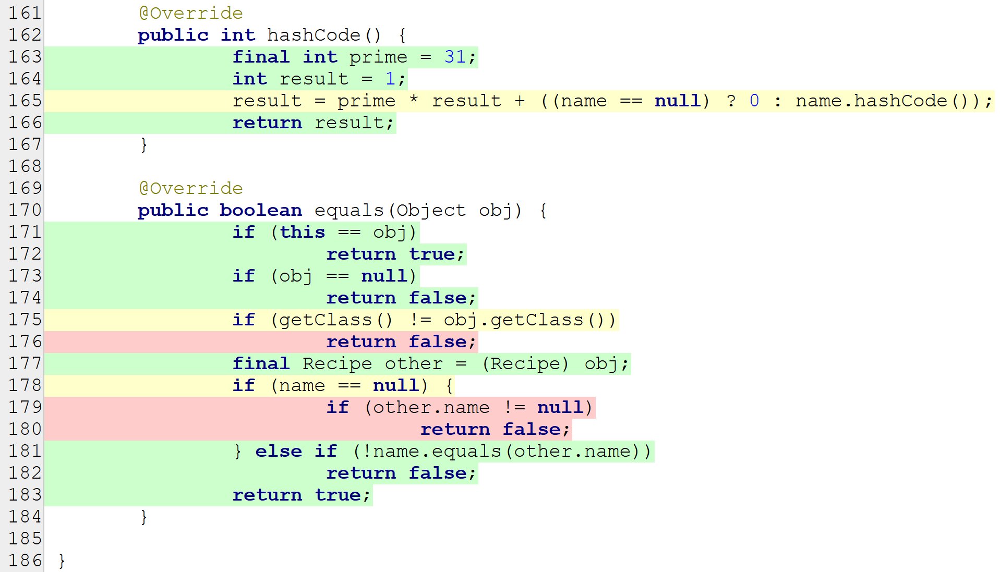

# Test Coverage Report

This report summarizes the code coverage metrics for various classes in the project. The coverage percentages include metrics for **Class**, **Method**, **Branch**, and **Line** coverage. Below are the results:

## Coverage Overview

| **Class**        | **Class %** | **Method %** | **Branch %** | **Line %**  |
|------------------|-------------|--------------|--------------|-------------|
| **CoffeeMaker**  | 100% (1/1)  | 100% (8/8)   | 100% (6/6)   | 95.2% (20/21) |
| **Inventory**    | 100% (1/1)  | 100% (16/16) | 100% (26/26) | 100% (72/72) |
| **Recipe**       | 100% (1/1)  | 100% (16/16) | 80.8% (21/26)| 95.2% (60/63) |
| **RecipeBook**   | 100% (1/1)  | 100% (5/5)   | 100% (16/16) | 100% (26/26) |

---

## Detailed Class Coverage Analysis

### **Recipe**

- **Class Coverage:** 100% (1/1)
- **Method Coverage:** 100% (16/16)
- **Branch Coverage:** 80.8% (21/26)
- **Line Coverage:** 95.2% (60/63)

The **Recipe** class has high coverage in terms of methods and class, but the branch coverage is slightly lower at 80.8%, indicating there might be some untested conditional branches. Line coverage is also very good at 95.2%.

#### Uncovered Branches

#### **Improve Branch Coverage in `hashCode` Method**
 - Test the scenario where `name` is `null`.

#### **Improve Branch Coverage in `equals` Method**
 - Test the scenario where `obj` is the instance of a different `class`.
 - Test the scenario where `name` is `null` for `this` but not for `obj`.

---
